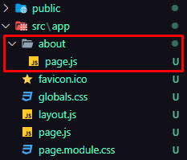

# Ada Love
## Getting Started

First, run the development server:

```bash
npm run dev
# or
yarn dev
# or
pnpm dev
# or
bun dev
```

Open [http://localhost:3000](http://localhost:3000) with your browser to see the result.

You can start editing the page by modifying `app/page.js`. The page auto-updates as you edit the file.

## Create New Route

You can create a new route by creating a new page and inside it creating a file called `page.js`. For example: `about/page.js`


